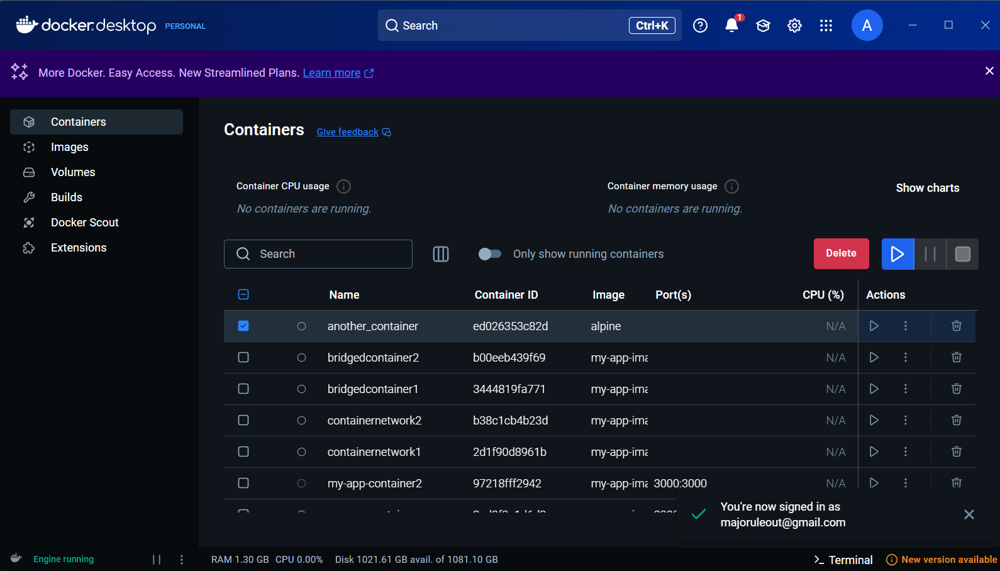
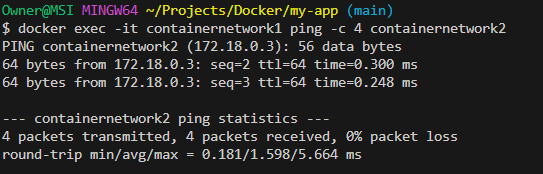
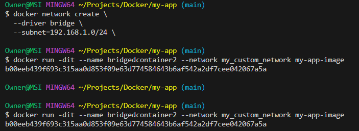

# **Introduction to Containerization**

## **The Concept of Containerization**

### **Definition and Purpose of Containerization**
Containerization is a lightweight form of virtualization that involves bundling an application and all its dependencies, such as libraries, configuration files, and binaries, into a self-contained package called a "container." These containers run consistently across different computing environments, ensuring that the application behaves the same way regardless of where it is deployed—whether on a developer's laptop, a testing environment, or a production server.

The purpose of containerization is to decouple an application from its underlying infrastructure. By doing so, it allows developers to focus on building applications without worrying about the complexities of the environment in which their software will run. Containers facilitate faster development, testing, and deployment cycles, making them a cornerstone of modern DevOps practices.

---

### **Advantages of Containerization for Consistency and Scalability**
One of the most significant benefits of containerization is **consistency**. Containers encapsulate everything an application needs to run, ensuring that the software operates reliably across various platforms and environments. This eliminates the "it works on my machine" issue, which often arises when applications depend on system-specific configurations.

In addition to consistency, containerization greatly enhances **scalability**. Containers are lightweight and can be started or stopped almost instantly. This allows organizations to scale applications horizontally by running multiple containers across a cluster. Orchestration tools like Kubernetes or Docker Swarm make scaling even more efficient by automating the management of containers, ensuring high availability and optimal resource usage. Moreover, containers isolate applications, allowing multiple containers to run on the same host without interfering with one another, which boosts the overall efficiency of resource utilization.

For businesses, these features translate into faster time-to-market, reduced operational overhead, and the ability to dynamically adjust to user demand.

---

### **Comparison of Containerization vs. Virtualization**
While both containerization and virtualization are technologies used to abstract and isolate computing environments, they differ significantly in their implementation and use cases.

**Virtualization** relies on hypervisors to create virtual machines (VMs), which are complete operating systems running on top of a physical host. Each VM includes its own operating system, making it more resource-intensive since the host has to allocate substantial computational power to multiple OS kernels. VMs are ideal for scenarios requiring the isolation of entire systems or running different operating systems on a single machine.

On the other hand, **containerization** uses the operating system’s kernel to share resources, allowing containers to run without the need for a full OS within each instance. Containers share the host OS, which makes them much lighter and faster to start compared to VMs. This resource efficiency enables a higher density of containers to run on a single host compared to virtual machines.

**Key Differences:**
1. **Overhead**: Containers are more lightweight as they share the host OS, whereas VMs are heavyweight due to their bundled OS.
2. **Startup Time**: Containers launch almost instantly, while VMs take longer as an entire OS needs to boot.
3. **Use Cases**: Virtualization is commonly used in scenarios like running legacy applications or isolating entire systems. Containerization is better suited for microservices architecture, agile development, and rapid scaling.

In conclusion, containerization has revolutionized software deployment by addressing the challenges of consistency and scalability. While virtualization still has its place in specific use cases, containerization has become the preferred choice for modern, cloud-native application development due to its efficiency, portability, and flexibility. By empowering developers to focus on innovation rather than infrastructure, containers are shaping the future of software engineering.



# **Understanding Docker and Container Basics**

## **Docker Architecture**
Docker is a platform that leverages containerization to enable developers to package and deploy applications in lightweight, portable containers. Its architecture is based on a client-server model comprising several key components:

- **Docker Daemon**
- **Docker Client**
- **Docker Images**
- **Docker Containers**
- **Docker Registries**

Each component has a distinct role in the lifecycle of a containerized application.

### **Docker Daemon**
The Docker Daemon (`dockerd`) is the core of Docker's architecture and runs on the host machine. It listens for API requests from the Docker Client and is responsible for managing Docker objects such as images, containers, networks, and volumes.

### **Docker Client**
The Docker Client (`docker`) is the primary interface through which users interact with Docker. It sends commands, such as `docker run` or `docker build`, to the Docker Daemon using Docker's REST API.

### **Docker Images**
Docker Images are immutable, read-only templates used to create containers. They package the application and all of its dependencies, ensuring a consistent runtime environment.

### **Docker Containers**
Docker Containers are runnable instances of Docker Images. They provide isolated environments for applications, sharing the host OS kernel while remaining lightweight.

### **Docker Registries**
Docker Registries, such as Docker Hub or private registries, store and distribute Docker Images, facilitating version control and collaboration within teams.

---

## **Hands-On Practical with Docker**

### **Commands Used to Build and Run a Docker Container**

1. **Build a Docker Image** from a Dockerfile:
   ```sh
   docker build -t my-app-image .
   ```

2. **Run a Container** using the built image:
   ```sh
   docker run -d -p 3000:3000 --name my-app-container my-app-image
   ```

3. **List All Docker Containers**:
   ```sh
   docker ps
   ```

4. **Start, Stop, and Remove a Docker Container**:
   ```sh
   docker start my-app-container
   docker stop my-app-container
   docker rm my-app-container
   ```




# **Container Orchestration and Networking**

## **Docker Networking Models**

### **1. Bridge Network (Default for Standalone Containers)**
- Used when running containers on a **single host**.
- Allows communication between containers using container names.
- Example:
  ```sh
  docker network create my_bridge_network
  ```

### **2. Host Network (Removes Network Isolation)**
- The container **shares the host’s network stack**.
- No need for port mapping (`-p` flag).
- Example:
  ```sh
  docker run --network host nginx
  ```

### **3. Overlay Network (For Multi-Host Swarm Communication)**
- Used in **Docker Swarm mode**.
- Example:
  ```sh
  docker network create --driver overlay my_overlay_network
  ```



## **Persistent Storage in Docker**

Containers are ephemeral, meaning data inside them is lost when they stop. Persistent storage allows data to survive beyond container lifecycles. Docker provides two main solutions:

1. **Volumes** (Recommended for production environments):
   ```sh
   docker volume create my_volume
   ```

2. **Bind Mounts** (Directly mounts a host directory):
   ```sh
   docker run -v /host/path:/container/path my-app-image
   ```

### **Example of Persistent Storage in Action**
```sh
docker run -dit --name my_new_container -v my_volume:/app/data my-app-image
docker exec -it my_new_container sh -c "echo 'Hello, Docker' > /app/data/hello.txt"
docker stop my_new_container
docker rm my_new_container
docker run -dit --name another_container -v my_volume:/app/data my-app-image
docker exec -it another_container cat /app/data/hello.txt
```
